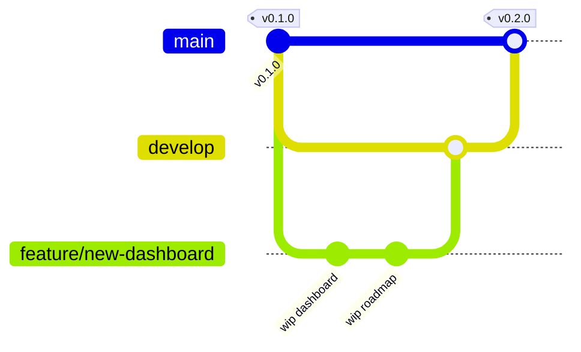

# Releasing SkillSync AI

This document describes the branching strategy and release process for SkillSync AI.

## Branching model

We use a simplified [Git Flow](https://nvie.com/posts/a-successful-git-branching-model/):

| Branch | Purpose |
|--------|---------|
| `main` | **Stable, production-ready code.** Every commit on `main` is a release candidate and is tagged with a version. Never push half-done work directly here. |
| `develop` | **Integration branch for ongoing work.** All feature branches merge here first. When `develop` is stable, it is merged into `main` and tagged as a new release. |
| `feature/<short-name>` | One branch per feature / bugfix (e.g. `feature/resume-parser-v2`, `fix/login-token-refresh`). Branch off `develop`, open a Pull Request back into `develop`. |
| `hotfix/<short-name>` | Urgent production fixes. Branch off `main`, open PR into both `main` and `develop`. |



## Versioning

We use [Semantic Versioning](https://semver.org/): `MAJOR.MINOR.PATCH`

- **MAJOR** — breaking API or UX changes.
- **MINOR** — new features, new endpoints, backwards-compatible.
- **PATCH** — bug fixes, small UI polish, security patches.

Examples: `0.2.0` → first feature release, `0.2.1` → a bugfix on top of it, `0.3.0` → next feature batch.

## Release workflow

1. Make sure all features for the release are merged into `develop` and CI passes.
2. Update `CHANGELOG.md` with a dated entry describing Added / Changed / Fixed.
3. Bump any version references (e.g. backend `app/__init__.py`, `package.json`).
4. Open a Pull Request from `develop` into `main`.
5. Once merged:
   ```bash
   git checkout main
   git pull origin main
   git tag -a vX.Y.Z -m "Release vX.Y.Z"
   git push origin vX.Y.Z
   ```
6. Create a GitHub Release at https://github.com/Kamaleshwaran-tech/skill_sync/releases/new
   - Title: `vX.Y.Z — <short headline>`
   - Body: copy the relevant section from `CHANGELOG.md`.
   - Attach build artifacts if/when we add a build pipeline.
7. Merge `main` back into `develop` so hotfix tags don't diverge.

## Hotfix workflow

1. `git checkout main && git checkout -b hotfix/<short-name>`
2. Fix the bug, commit, test.
3. Open PRs into both `main` and `develop`.
4. After merge, tag a new PATCH release (`vX.Y.Z+1`).

## What we did NOT use (and why)

- We did **not** set up environment branches (`staging`, `prod`) — the app is small and the database is SQLite for now. When we deploy to a real host with a real DB, we'll add a `staging` branch that auto-deploys to a staging environment.
- We did **not** set up CI/CD yet (GitHub Actions). Next steps: add a workflow that runs backend tests + frontend lint/build on every PR, and auto-publishes a GitHub Release on tag push.
